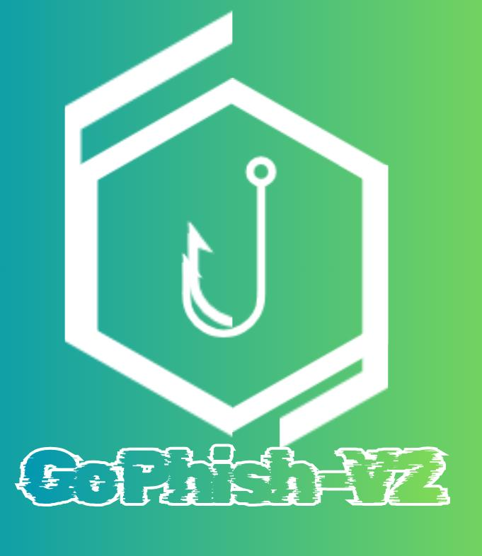

<div align="center">



# GoPhish v2

**Enterprise-grade, open-source phishing simulation & security-awareness platform**

*The powerful continuation of [GoPhish](https://github.com/gophish/gophish) — SMS, MFA, QR, teams, RBAC, reporting & more, in one production-ready build.*

[](https://go.dev)
[](LICENSE)
[]()
[](docker-compose.yml)
[](https://github.com/gophish/gophish)

</div>

---

> ⚠️ **LEGAL NOTICE** — GoPhish v2 is intended **exclusively** for authorised security-awareness testing, phishing simulations, and red-team engagements. Using it against systems or people without **explicit written permission** is illegal. Operators are responsible for compliance with local laws. See the full notice at the bottom.

---

## Table of Contents

1. [Why GoPhish v2?](#why-gophish-v2)
2. [Features](#features)
3. [Architecture](#architecture)
4. [Quick Start — Docker](#quick-start--docker)
5. [Quick Start — From Source](#quick-start--from-source)
6. [Configuration](#configuration)
7. [Environment Variables](#environment-variables)
8. [Feature Guide](#feature-guide)
9. [REST API](#rest-api)
10. [Production Hardening](#production-hardening)
11. [Credits & Attribution](#credits--attribution)
12. [License](#license)

---

## Why GoPhish v2?

The original [GoPhish](https://github.com/gophish/gophish) is no longer actively maintained. Over the years the community produced excellent forks — each adding valuable features in isolation.

**GoPhish v2 unifies the best of them into one coherent, battle-tested codebase**, adds modern security hardening, and keeps everything you loved about the original.

| Inherited from | Key contribution |
|---|---|
| [anglerphish](https://github.com/geopetro/anglerphish) | SMS campaigns, MFA simulation, QR codes, campaign sets, DOCX/XLSX reports, IMAP monitor, credential encryption |
| [aramido](https://github.com/aramido/gophish) | Teams, RBAC, scenarios |
| [evait-security](https://github.com/evait-security/gophish) | CI/CD pipeline, timezone support, bug fixes |
| [kgretzky](https://github.com/kgretzky/gophish) | Evilginx integration |
| [jellyphish](https://github.com/h4mr3r/jellyphish) | Enhanced phishing server |
| [xorrior](https://github.com/xorrior/gophish) | Extended payload options |
| [gophish-clean](https://github.com/vflame6/gophish-clean) | Code-quality refactors |
| [gophishLastPLUS](https://github.com/Nitraxenius/gophishLastPLUS) | UI improvements |
| [gophish-patched](https://github.com/austinzwile/gophish-patched) | Security hardening |

---

## Features

### Core (from upstream GoPhish)
- 📧 **Email phishing campaigns** — open/click tracking, send scheduling, throttling
- 🖥️ **Landing pages** — WYSIWYG editor, credential capture, redirect support
- ✉️ **Template system** — rich HTML email templates with `{{.FirstName}}`, `{{.URL}}` variable substitution and file attachments
- 🔌 **Sending profiles** — SMTP with custom headers
- 👥 **User & group management** — CSV import/export
- 📊 **Real-time dashboard** — live results, per-target event timelines
- 🔑 **REST API** — full API-key automation support

### New in v2
| Feature | Description |
|---|---|
| 📱 **SMS campaigns** | Phishing SMS via any Twilio-compatible provider, with click tracking |
| 🔐 **MFA simulation** | Fake OTP step after credential capture (SMS-delivered) — records submitted codes |
| 🔗 **QR code generator** | Trackable QR codes (PNG/SVG) for physical red-team drops |
| 🗂️ **Campaign sets** | Group & schedule multi-wave campaigns (email + SMS) |
| 📄 **Report engine** | One-click **DOCX / XLSX** executive reports via bundled Python engine |
| 📥 **IMAP monitor** | Passive inbox monitoring for replies, bounces, auto-responders |
| 🎭 **Scenarios** | Reusable playbooks combining template + page + profile |
| 👥 **Teams & RBAC** | Multi-operator teams with isolated data namespaces; admin/user roles |
| 🛡️ **Credential encryption** | AES-256-GCM encryption of SMTP/SMS secrets at rest |
| 🌑 **Dark themes** | Dark Teal, Dark Crimson & SOC themes, per-user preference |
| 🕐 **Timezone support** | Campaign scheduling in operator-local time |
| 🧟 **Evilginx support** | Route phish traffic through Evilginx for session harvesting |
| 🗄️ **Server-side sessions** | Hardened admin sessions with database backing |
| 📝 **Audit logging** | Tamper-evident audit trail of operator actions |

---

## Architecture

```
┌──────────────────────────────────────────────────────┐
│               Single Docker Container                │
│                                                      │
│  ┌────────────┐          ┌────────────────────┐      │
│  │  Admin UI  │          │  Phishing Server   │      │
│  │   :3333    │          │    :80 / :443      │      │
│  │ (REST API  │          │ (phish routes, MFA │      │
│  │  + Web UI) │          │ flow, cred capture)│      │
│  └─────┬──────┘          └─────────┬──────────┘      │
│        └───────────┬───────────────┘                 │
│             ┌──────▼───────┐                         │
│             │ GoPhish Core │                         │
│             │ Worker queue │                         │
│             │ (email + SMS)│                         │
│             └──────┬───────┘                         │
│             ┌──────▼───────┐                         │
│             │ SQLite/MySQL │                         │
│             └──────────────┘                         │
│                                                      │
│  Python venv → python-docx, openpyxl, geoip2         │
│  (report generation, installed on first build)       │
└──────────────────────────────────────────────────────┘
```

**Data flow:** create campaign → worker sends email/SMS → target interacts with phishing server → events (sent, opened, clicked, credentials, MFA) recorded → export as DOCX/XLSX report.

---

## Quick Start — Docker

**Prerequisites:** Docker ≥ 20.10 (Compose ≥ 2.0 recommended)

```bash
git clone https://github.com/<your-user>/GoPhish-v2.git
cd GoPhish-v2
docker compose up -d --build
```

The first build compiles the Go binary, minifies frontend assets, and installs the Python report dependencies. Subsequent starts reuse the image.

**Get the auto-generated admin password:**

```bash
docker compose logs gophish | grep "Please login"
```

| Service | URL | Notes |
|---|---|---|
| Admin UI | `http://localhost:3333` | Login with `admin` + password from logs |
| Phishing server | `http://localhost:80` | Serves campaign landing pages |

<details>
<summary><b>Plain Docker (no Compose)</b></summary>

```bash
docker build -t gophish-v2 .

docker run -d \
  --name gophish-v2 \
  -p 3333:3333 \
  -p 80:80 \
  -v gophish-data:/opt/gophish/data \
  gophish-v2
```
</details>

---

## Quick Start — From Source

**Requirements:** Go 1.24+ · Node.js 20+ (npm/yarn) · Python 3.9+

```bash
# 1. Frontend assets
npm install
npm install -g gulp gulp-cli
gulp

# 2. Python report engine (optional, for DOCX/XLSX reports)
python3 -m venv reports/venv
reports/venv/bin/pip install -r reports/python/requirements.txt

# 3. Build & run
go build -o gophish .
./gophish
```

The admin UI starts at `https://localhost:3333` (TLS on by default — a self-signed cert is generated on first run).

---

## Configuration

`config.json` — every value can be overridden via [environment variables](#environment-variables):

```json
{
  "admin_server": {
    "listen_url": "127.0.0.1:3333",
    "use_tls": true,
    "cert_path": "gophish_admin.crt",
    "key_path": "gophish_admin.key",
    "trusted_origins": []
  },
  "phish_server": {
    "listen_url": "0.0.0.0:80",
    "use_tls": false,
    "cert_path": "example.crt",
    "key_path": "example.key"
  },
  "db_name": "sqlite3",
  "db_path": "gophish.db",
  "migrations_prefix": "db/db_",
  "contact_address": "",
  "logging": { "filename": "", "level": "" }
}
```

### CLI flags

| Flag | Description |
|---|---|
| `--config <path>` | Path to `config.json` (default `./config.json`) |
| `--mode all\|admin\|phish` | Run a single component (multi-system deployments) |
| `--disable-mailer` | Disable the send worker |
| `--workdir <dir>` | Working directory for data files |
| `--generate-encryption-key` | Print a new random AES-256 key and exit |
| `--migrate-encryption` | Encrypt all plaintext credentials in the DB |
| `--migrate-decryption` | Decrypt all credentials (key rotation) |
| `--encryption-status` | Show whether encryption is active |
| `--dry-run` | Preview a migration without writing |

---

## Environment Variables

All optional — unset variables fall back to `config.json` values.

### Admin & phishing servers
| Variable | Example | Description |
|---|---|---|
| `ADMIN_LISTEN_URL` | `0.0.0.0:3333` | Admin interface bind address |
| `ADMIN_USE_TLS` | `true` | HTTPS on admin server |
| `ADMIN_CERT_PATH` / `ADMIN_KEY_PATH` | `certs/admin.crt` | TLS cert/key paths |
| `ADMIN_TRUSTED_ORIGINS` | `https://ops.example.com` | Comma-separated trusted CSRF origins |
| `PHISH_LISTEN_URL` | `0.0.0.0:80` | Phishing server bind address |
| `PHISH_USE_TLS` | `true` | HTTPS on phishing server |
| `PHISH_CERT_PATH` / `PHISH_KEY_PATH` | `certs/phish.crt` | TLS cert/key paths |

### Database
| Variable | Example | Description |
|---|---|---|
| `DB_NAME` | `mysql` | `sqlite3` (default) or `mysql` |
| `DB_FILE_PATH` | SQLite path **or** MySQL DSN | e.g. `user:pass@(host:3306)/gophish?charset=utf8&parseTime=True&loc=UTC` |

### Security & misc
| Variable | Example | Description |
|---|---|---|
| `ANGLERPHISH_ENCRYPTION_KEY` | 64 hex chars | AES-256 key for credential encryption — generate with `--generate-encryption-key` |
| `CONTACT_ADDRESS` | `security@company.com` | Contact email shown in the UI |

---

## Feature Guide

### 📱 SMS Campaigns
Send phishing SMS via any **Twilio-compatible API**. Create an SMS-type sending profile (Account SID, Auth Token, From number), then set the campaign type to `sms` and pick an SMS template. SMS templates use the same variables (`{{.FirstName}}`, `{{.URL}}`) with a 160-char limit; clicks are tracked in the campaign timeline like email.

### 🔐 MFA Simulation
Adds a realistic fake-OTP step after credential capture:
1. Target submits credentials on the landing page
2. GoPhish generates an OTP and texts it to the target's phone (from the group's `phone` field)
3. Target enters the code on the follow-up page
4. Both credentials **and** the OTP are recorded

Events: `MFA Code Sent` / `MFA Code Verified` / `MFA Code Failed`. Enable the MFA toggle in the landing-page editor.

### 🔗 QR Code Generator
Generate trackable QR codes (PNG/SVG) encoding any URL with a `rid` parameter — clicks appear in the campaign timeline exactly like email clicks. Ideal for USB drops, posters, and badges.

### 🗂️ Campaign Sets
Group multiple campaigns into a coordinated exercise — multi-wave (email → SMS follow-up), A/B template testing, or staggered launches with configurable delays.

### 📄 Report Engine (DOCX / XLSX)
One-click executive reports from the **Reports** page:
- **DOCX** — narrative summary + per-target breakdown
- **XLSX** — raw event data, pivot-ready sheets, timeline
- GeoIP2 enriches IPs with country/city (bundled MaxMind database)

### 📥 IMAP Monitor
Passively monitor an inbox for replies, bounces, and auto-responders without sending anything — track out-of-office replies and detect target-reported phish.

### 🎭 Scenarios
Reusable playbooks binding template + landing page + sending profile. Select **Use Scenario** when creating a campaign to pre-populate everything — ideal for standardised, repeat engagements.

### 👥 Teams & RBAC
| Role | Capabilities |
|---|---|
| `admin` | Everything: user/team management, webhooks, all teams' data |
| `user` | Own campaigns/templates/groups/pages/profiles, team-scoped visibility |

Each team gets an isolated data namespace — members never see other teams' campaigns.

### 🛡️ Credential Encryption
AES-256-GCM at rest for SMTP passwords and SMS API keys:

```bash
# 1. Generate a key
./gophish --generate-encryption-key

# 2. Export it in your environment
export ANGLERPHISH_ENCRYPTION_KEY="a1b2c3..."

# 3. Encrypt existing plaintext credentials
./gophish --migrate-encryption
```

⚠️ Store the key in a vault/password manager — **losing it means losing all encrypted credentials**.

### 🌑 Themes
Default, **Dark Teal**, **Dark Crimson**, and **SOC** themes — switchable in Account Settings, persisted per-user with no flash-on-load.

---

## REST API

Interactive docs run in-app at `http://localhost:3333/api_documentation`.

**Authentication** — every request needs:

```
Authorization: Bearer <api_key>
```

API key: **Account Settings → API Key**.

| Method | Path | Description |
|---|---|---|
| `GET/POST` | `/api/campaigns/` | List / create campaigns |
| `GET/DELETE` | `/api/campaigns/:id` | Get / delete a campaign |
| `GET` | `/api/campaigns/:id/results` | Detailed results |
| `GET` | `/api/campaigns/:id/summary` | Summary statistics |
| `GET/POST` | `/api/templates/` · `/api/pages/` · `/api/smtp/` · `/api/groups/` | Core resources |
| `GET/POST` | `/api/sms/` · `/api/sms_templates/` | SMS profiles & templates |
| `GET/POST` | `/api/campaign_sets/` · `/api/scenarios/` | Sets & scenarios |
| `GET/POST` | `/api/teams/` · `/api/users/` | Teams & users (admin) |
| `POST` | `/api/util/send_test_email` · `/api/util/send_test_sms` | Send tests |
| `GET/POST` | `/api/reports/` | List / generate reports |

---

## Production Hardening

1. **Never expose the admin panel publicly** — bind to `127.0.0.1:3333` and reverse-proxy via Nginx/Caddy with auth/IP allow-listing
2. **Enable TLS everywhere** — `ADMIN_USE_TLS`/`PHISH_USE_TLS` with real certificates
3. **Set `ADMIN_TRUSTED_ORIGINS`** to your operator-facing origin(s) only
4. **Enable credential encryption** — see [Credential Encryption](#-credential-encryption)
5. **Persist data** — mount a named volume at `/opt/gophish/data`
6. **Use MySQL** for large deployments or multi-instance setups
7. **Restrict port 3333** at the firewall/security-group level to operator IPs

---

## Credits & Attribution

GoPhish v2 stands on the shoulders of giants:

- **[Jordan Wright](https://github.com/jordan-wright)** — the original GoPhish
- **[geopetro / anglerphish](https://github.com/geopetro/anglerphish)** — SMS, MFA, QR, campaign sets, reports, IMAP monitor, encryption
- **[aramido](https://github.com/aramido/gophish)** — teams, RBAC, scenarios
- **[evait-security](https://github.com/evait-security/gophish)** — CI/CD, timezones
- **[kgretzky](https://github.com/kgretzky/gophish)** — Evilginx integration
- **[h4mr3r / jellyphish](https://github.com/h4mr3r/jellyphish)** — phishing server enhancements
- **[xorrior](https://github.com/xorrior/gophish)** — payload extensions
- **[vflame6 / gophish-clean](https://github.com/vflame6/gophish-clean)** — code quality
- **[Nitraxenius / gophishLastPLUS](https://github.com/Nitraxenius/gophishLastPLUS)** — UI improvements
- **[austinzwile / gophish-patched](https://github.com/austinzwile/gophish-patched)** — security hardening

---

## License

Released under the **MIT License** — see [LICENSE](LICENSE).

---

> **Legal notice:** This software is provided for **authorised security awareness testing and red-team exercises only**. The operator is solely responsible for obtaining explicit written permission before testing any system or individual. Unauthorised use is illegal in most jurisdictions. The authors and contributors accept no liability for misuse.
